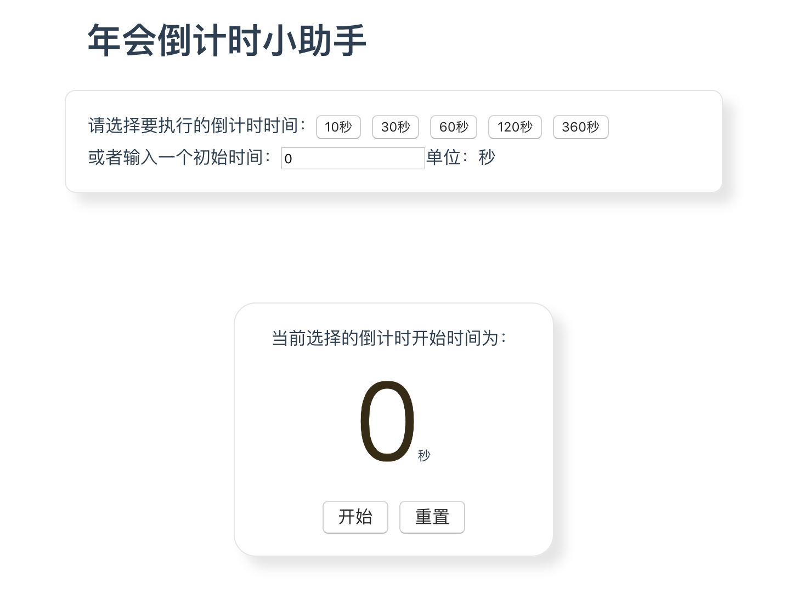
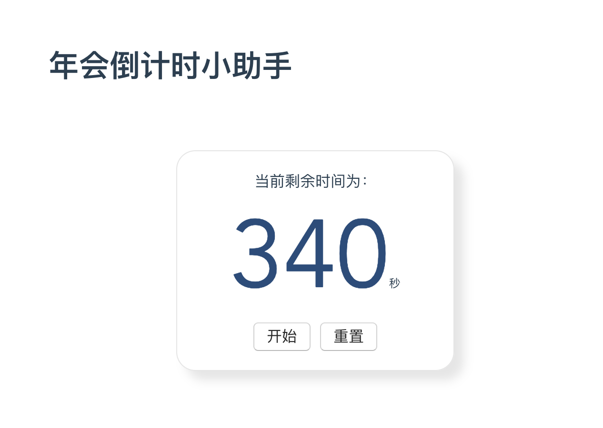

# 时间倒计时

为公司年会抽空写的一个倒计时小程序

主要功能有:
- 可快速选择倒计时时间
- 可自定义倒计时时间
- 倒计时开始时特效动画
- 随时重置功能
- 倒计时数字颜色在深色范围内随机

截图：



## 如何运行
```
yarn install
```

### Compiles and hot-reloads for development
```
yarn serve
```

### Compiles and minifies for production
```
yarn build
```

### Lints and fixes files
```
yarn lint
```

### Customize configuration
See [Configuration Reference](https://cli.vuejs.org/config/).
